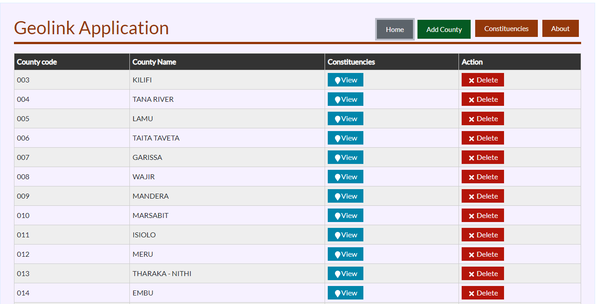
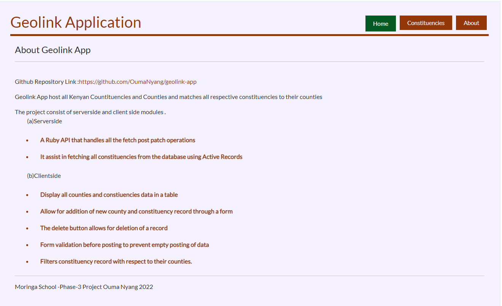
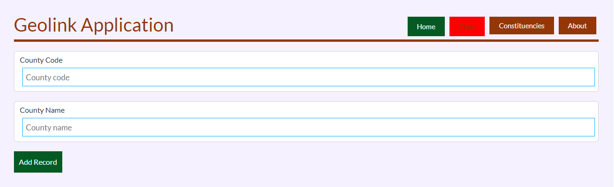
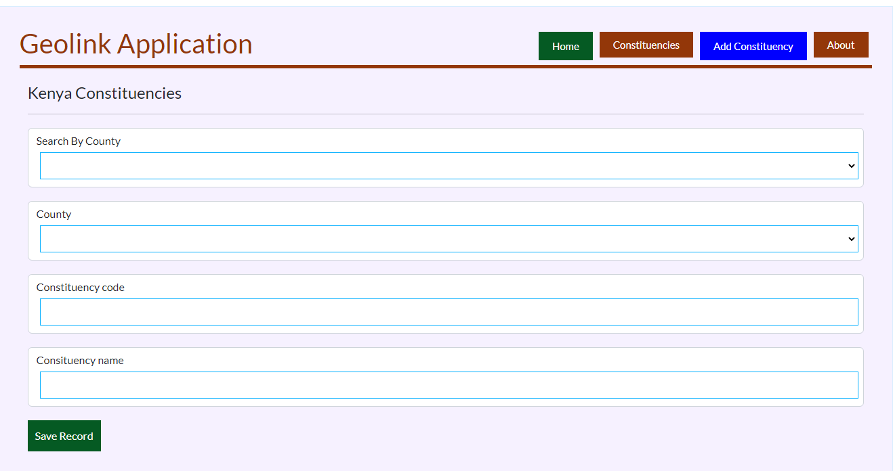

## Phase 3  Project ##
 > Github Repository Link :: ```https://github.com/OumaNyang/geolink-app```
### Geolink App
#### About Geolink App ####
This project consist of the client side and the serverside modules;
#### (a) Serverside 
  > Serverside Github Link :: ```https://github.com/OumaNyang/geolink-app/serverside```
 
This is the end post for all ``POST,PATCH and DELETE``  operations from the clientside.
* A Ruby API that handles all the  fetch post patch operations 
* It assist in fetching all constituencies  from the database using Active  Records

#### Serverside Technologies
Serverside  is created with:
```Ruby,SQL lite & Active Records``` 

#### (a) Clientside 
 > Clientside  Github Link :: ```https://github.com/OumaNyang/geolink-app/clientside```

* A Ruby API that handles all the  fetch post patch operations 
* It assist in fetching all constituencies  from the database using Active  Records

#### Serverside Technologies
Clientside  is created with:
```HTML,CSS,Javascript & React JS```

How the Clientside works 
* Display all counties and constiuencies data in  a table
* Allow for addition of new county  and constituency record through a form
* The delete button allows for deletion of a record
* Form validation before posting to prevent empty posting of data
* Filters constituency record with respect to their counties.

</hr>

### Setup ###
First [Clone](https://github.com/OumaNyang/geolink-app) this repo 

Open project terminal  and change directory  ``cd clientside `` to the clientside folder 

Run  ``bundle install``

Start the back end [serverside] server by runing the command ``bundle exec rake server``

``` The base URL for the  backend is: http://localhost:9292 ```

Open Terminal on the  and change directory  cd serverside to the serverside folder 

Run  ```npm install```

Start the front end [clientside] server by runing the command ``npm start``

The base URL for your front end is: ``` http://localhost:3000 ```

### Screenshots ###








### Moringa School -Phase-3 Project Ouma Nyang 2022
```Licence: MIT Licence ```
  
